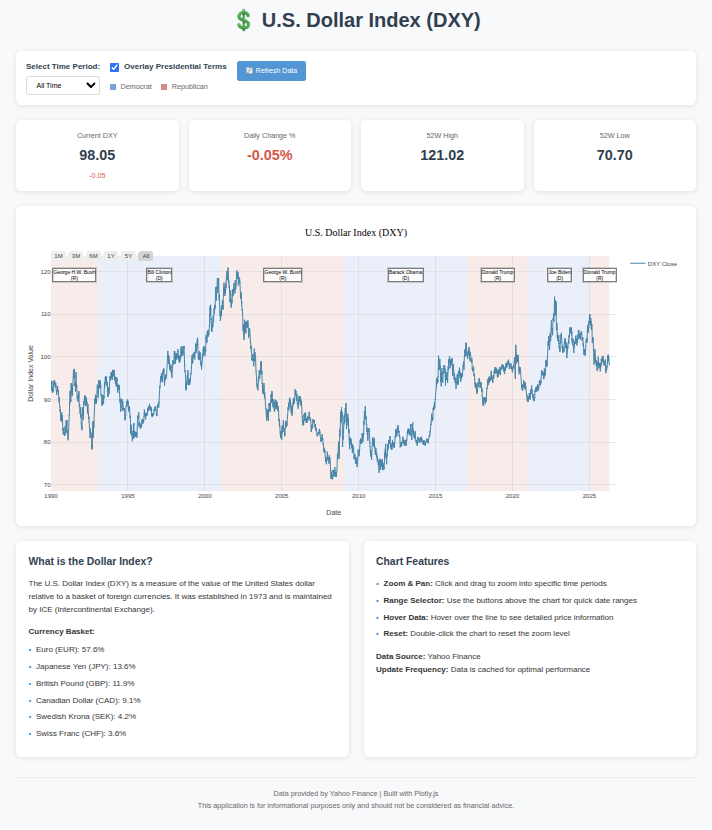

[](https://github.com/jlowder/DollarIndexTracker/blob/main/LICENSE)
[](https://raw.githubusercontent.com/jlowder/DollarIndexTracker/main/dollar_index_tracker.html)
[](https://github.com/jlowder/DollarIndexTracker)
[](#)

# U.S. Dollar Index (DXY) Interactive Chart

An interactive, self-contained web application for visualizing U.S. Dollar Index data with zoom and pan functionality, along with historical presidential term overlays.


*Figure 1: U.S. Dollar Index Tracker showing live data with presidential term overlays*

## Features

- **Real-time DXY data**: Fetches data from Yahoo Finance via robust CORS proxies with multiple fallback mechanisms and intelligent "Smart Selection" to prioritize successful connection paths.
- **Chunked Data Loading**: Efficiently retrieves high-resolution daily data for long historical periods (5y, 10y, Max) by automatically slicing requests into manageable 2-year chunks to avoid proxy timeouts.
- **Offline/Simulated Mode**: Automatically falls back to high-quality simulated data if live financial servers are unreachable, with clear UI indicators.
- **Interactive charts**: Zoom and pan capabilities powered by Plotly.js.
- **Presidential Overlays**: Toggle visibility of U.S. presidential terms to see historical context.
- **Multiple time periods**: Select from 1 month to "All Time" (back to the 1990s).
- **Key metrics**: Displays current price, daily change, and 52-week high/low.
- **Zero dependencies**: No backend server or Python environment required.

## How to Run

Since this is a self-contained HTML application, you can run it in several ways:

### Option 1: Direct Open
Simply open `dollar_index_tracker.html` in any modern web browser.

### Option 2: Local Web Server
For a better experience, you can serve it using a simple local server:

**Using Python:**
```bash
python -m http.server 8000
```

**Using Node.js (npx):**
```bash
npx serve .
```

Then visit `http://localhost:8000` (or the port provided).

## Technical Details

- **Frontend**: HTML5, CSS3, and Vanilla JavaScript.
- **Charting Library**: [Plotly.js](https://plotly.com/javascript/)
- **Data Source**: Yahoo Finance (ticker: `DX-Y.NYB`)
- **CORS Mitigation**: Employs a `fetchWithFallback` mechanism that cycles through multiple proxies (AllOrigins, CORSProxy.io) and Yahoo endpoints (query1, query2) to ensure data reliability, even when loaded via the `file://` protocol.
- **Visual Feedback**: Includes a detailed loading overlay with a progress bar and status text that tracks data slice acquisition and proxy connection attempts.

## Simulated Data & Offline Mode

If the application cannot connect to live financial servers (e.g., due to network issues or restrictive CORS environments), it will automatically enter **Simulated Mode**. This is clearly indicated in the UI:

1.  **Warning Banner**: A yellow "DATA STATUS: SIMULATED / OFFLINE MODE" message appears at the top.
2.  **Badge**: A "⚠️ SIMULATED DATA" tag is displayed above the metrics.
3.  **Chart Title**: The chart title changes to red and includes the suffix "- SIMULATED DATA".

This ensures that users are always aware of whether they are viewing live market data or generated demonstration data.

## About the Dollar Index

The U.S. Dollar Index (DXY) measures the value of the United States dollar relative to a basket of foreign currencies:

- Euro (EUR): 57.6%
- Japanese Yen (JPY): 13.6%
- British Pound (GBP): 11.9%
- Canadian Dollar (CAD): 9.1%
- Swedish Krona (SEK): 4.2%
- Swiss Franc (CHF): 3.6%

## License

MIT

---
*Disclaimer: This application is for informational purposes only and should not be considered as financial advice.*
